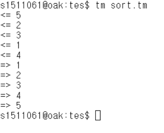

# C-minus 컴파일러
----------------------------------------
> 상명대학교 컴파일러 수업 과제

## 프로젝트 개요

- 프로젝트 명
  * C-minus 컴파일러 만들기

- 프로젝트 기간
  * 2019 - 03 - 04 ~ 2019 - 06 - 16  

- 개발 대상
  * flix를 이용하여 scanner 만들기 [(hw03)](https://github.com/ckdgus0505/C-Minus-Compier/tree/master/hw03)
  * bison을 이용하여 parser 만들기 [(hw05)](https://github.com/ckdgus0505/C-Minus-Compier/tree/master/hw05)
  * bison을 이용하여 symbol table 만들기 [(hw06)](https://github.com/ckdgus0505/C-Minus-Compier/tree/master/hw06)
  * bison을 이용하여 컴파일러 만들기 [(project)](https://github.com/ckdgus0505/C-Minus-Compier/tree/master/project)

- 구현 환경
  * linux

- 개발 언어
  * C

- 개발 도구
  * flix, bison
  
- 타겟 머신
  * 타이니 머신
-------------------------------------

Input File
[sort.c](./sort.c)

Output File
[sort.tm](./sort.tm.txt)

Execution Result

