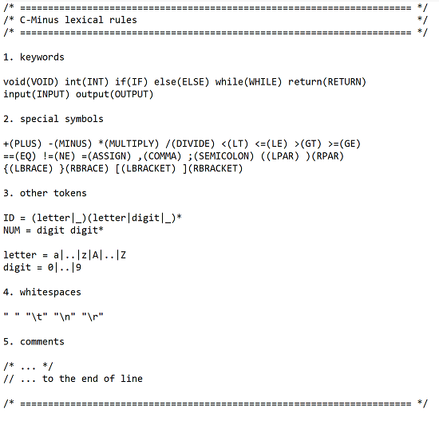

# flix를 이용하여 scanner 만들기
----------------------------------------
> 상명대학교 컴파일러 수업 과제

## 프로젝트 개요

- 프로젝트 명
  * C-minus 컴파일러 만들기

- 프로젝트 기간
  * 2019 - 04 - 01 ~ 2019 - 04 - 15

- 구현 환경
  * linux

- 개발 도구
  * flix
  
- 생성 파일
  * scanner.l
  
-------------------------------------

C-minus Lexical-Rules

